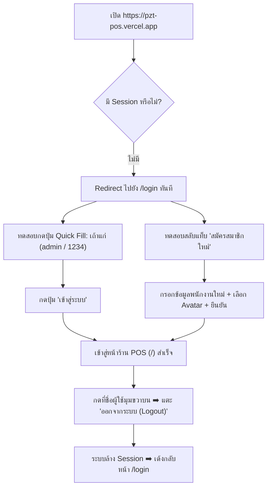
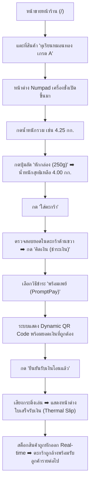

# 🍈 เอกสารส่งมอบงานและคู่มือการทดสอบระบบ (PZT Fruit POS - Handover Specification)

> **เอกสารฉบับนี้จัดทำขึ้นเพื่อส่งมอบระบบ PZT Fruit POS สำหรับผู้ดูแลระบบ, ผู้ใช้งาน, และ AI QA Agent (Codex)** เพื่อใช้ในการตรวจสอบฟีเจอร์ทั้งหมด (Features Breakdown), โครงสร้างสิทธิ์ (Role & Permissions), โฟลว์การทดสอบการใช้งานจริง (Test Flows & User Journeys) และข้อมูลทางเทคนิคทั้งหมด

---

## 1. ข้อมูลสำคัญในการเข้าใช้งานระบบ (System Access & Credentials)

* **🌐 Live Production URL**: [https://pzt-pos.vercel.app](https://pzt-pos.vercel.app)
* **💻 Local Dev Server**: `http://localhost:3000` (รันคำสั่ง `npm run dev`)
* **📦 GitHub Repository**: [https://github.com/Pattrapol/pzt_pos](https://github.com/Pattrapol/pzt_pos)
* **☁️ Cloud Database**: Supabase (PostgreSQL) รองรับการทำงานแบบ **Local-First (Offline 100%) + Cloud Sync**

### 🔑 บัญชีทดสอบเริ่มต้น (Default Credentials)

| บัญชีผู้ใช้ | Username | Password / PIN | สิทธิ์ (Role) | สิทธิ์การเข้าถึง |
| :--- | :---: | :---: | :---: | :--- |
| 👑 **เถ้าแก่ (เจ้าของร้าน)** | `admin` | **`1234`** | `super_admin` | เข้าถึงได้ทุกเมนู (ขายหน้าร้าน, SKU, พนักงาน, ต้นทุน, กำไร, ตั้งค่าร้าน) |
| 👷‍♂️ **สมชาย (คนงาน/แคชเชียร์)** | `worker` | **`1111`** | `worker` | ขายหน้าร้าน, ชั่งน้ำหนัก, ออกใบเสร็จ, ดูบิลขาย และพิมพ์ใบเสร็จซ้ำ |

> 🛡️ **Admin Master PIN (รหัสลับเจ้าของร้าน)**: **`1234`** *(ใช้สำหรับอนุมัติการสมัครสิทธิ์แอดมิน หรือปลดล็อกหน้าจอฉุกเฉิน)*

---

## 2. โครงสร้างสิทธิ์การใช้งาน (Role-Based Access Control)

ระบบถูกออกแบบโดยแบ่งหน้าที่การทำงานชัดเจนระหว่าง **เจ้าของร้าน (เถ้าแก่)** และ **พนักงานหน้าร้าน (คนงาน)**:

| เมนู / ฟังก์ชัน | Path | สิทธิ์คนงาน (worker) | super ADMIN | วัตถุประสงค์ |
| :--- | :---: | :---: | :---: | :--- |
| **หน้าเข้าสู่ระบบ & สมัคร** | `/login` | ✅ | ✅ | ลงชื่อเข้าใช้ / สมัครสมาชิกพนักงานใหม่ |
| **แคชเชียร์ขายหน้าร้าน** | `/` | ✅ | ✅ | ค้นหาสินค้า, ชั่งน้ำหนัก, รับเงิน, ออกใบเสร็จ |
| **บิลขาย & ลูกหนี้** | `/orders` | ✅ | ✅ | ดูประวัติบิล, ค้นหาตามแคชเชียร์, รับชำระหนี้, พิมพ์สลิปซ้ำ |
| **สรุปกะปิดร้าน (Z-Report)** | Modal | ✅ | ✅ | ตรวจนับเงินในลิ้นชักประจำวัน แยกยอดขายตามแคชเชียร์ |
| **จัดการสินค้า & SKU** | `/products` | ❌ | ✅ | เพิ่ม/แก้ไขผลไม้, กำหนดราคา, รหัส SKU, จัดการหมวดหมู่ |
| **กำไร-ขาดทุน (P&L)** | `/dashboard` | ❌ | ✅ | ดูรายได้, ต้นทุนผลไม้, ค่าใช้จ่าย, ของเสีย, กำไรสุทธิ, % Yield |
| **ล็อต & ต้นทุนรับเข้า** | `/lots` | ❌ | ✅ | บันทึกการเหมาสวน/รับซื้อผลไม้, คำนวณต้นทุนเฉลี่ยต่อ กก. |
| **รายจ่าย & ของเสีย** | `/expenses` | ❌ | ✅ | บันทึกค่าน้ำมัน, ค่าแรงแกะเนื้อ, บันทึกทุเรียนเน่า/เสีย |
| **พนักงาน & กำหนดสิทธิ์** | `/users` | ❌ | ✅ | จัดการรายชื่อพนักงาน, รีเซ็ต PIN, ระงับบัญชี, เปลี่ยน Master PIN |
| **ตั้งค่าร้าน & Go-Live** | `/settings` | ❌ | ✅ | ข้อมูลร้าน, พร้อมเพย์, ล้างข้อมูลทดสอบเพื่อเปิดร้านจริง |

---

## 3. รายละเอียดฟีเจอร์ทั้งหมดในระบบ (Complete Feature Matrix)

### 3.1 ระบบ Authentication & Route Protection (`/login`)
- **Route Guard (AuthGate)**: บังคับให้ผู้ใช้งานต้องล็อกอินก่อนเข้าถึงหน้า POS หากยังไม่ล็อกอิน จะ Redirect ไป `/login` อัตโนมัติ
- **Standard Login Form**:
  - ช่องกรอก Username / Phone
  - ช่องกรอก Password / PIN พร้อมปุ่มกดดูรหัสผ่าน 👁️ (Eye toggle)
  - ระบบ Remember Me จดจำการเข้าสู่ระบบ
- **Registration Form (สมัครสมาชิกใหม่)**:
  - สมัครพนักงานใหม่ได้โดยตรง พร้อมเลือกรูป Avatar Emoji (👑, 👷‍♂️, 👩‍🌾, 🍈 ฯลฯ)
  - หากเลือกสิทธิ์ `super_admin` ระบบจะบังคับกรอก **Admin Master PIN** เพื่อความปลอดภัย
- **Quick Demo Fill Buttons**: ปุ่มคลิกเดียวเพื่อกรอกบัญชี `เถ้าแก่ (1234)` หรือ `คนงาน (1111)` สำหรับทดสอบระบบอย่างรวดเร็ว
- **Logout System**: ปุ่มออกจากระบบสีแดงทั้งบน Desktop Navbar (Profile Popover) และ Mobile Drawer ล้าง Session และเตะกลับหน้า `/login` ทันที

### 3.2 แคชเชียร์ขายหน้าร้าน & เครื่องชั่งน้ำหนักอัจฉริยะ (`/`)
- **Responsive Fruit Catalog Grid**: การ์ดแสดงผลไม้ขนาดใหญ่ สบายตา รองรับทั้งมือถือ (2 คอลัมน์), แท็บเล็ต/แล็ปท็อป (3 คอลัมน์) และจอกว้าง (4 คอลัมน์) โดยชื่อสินค้าไม่ถูกตัดทอน (`...`)
- **Smart Tare Weight Numpad (ระบบหักน้ำหนักภาชนะ)**:
  - เมื่อแตะที่สินค้าที่เป็นทุเรียนชั่ง กก. จะมี Numpad เสมือนจริงเด้งขึ้นมา
  - ปุ่มหักภาชนะด่วน: **หักกล่อง (250g)**, **หักเข่ง (1.5kg)**, **หักถุง (50g)** หรือกำหนดน้ำหนักหักเองได้
  - คำนวณน้ำหนักสุทธิและราคาขายให้อัตโนมัติแบบ Real-time
- **ระบบเสียงและโหมดผู้สูงอายุ**:
  - เสียงตอบรับตอนคิดเงิน (`playCashChime()`) และเสียงกดปุ่ม (`playBeep()`)
  - ปุ่ม **Zoom Toggle (ขยายตัวหนังสือใหญ่พิเศษ)** สำหรับผู้สูงอายุหรือสายตายาว
- **การรับชำระเงินหลายรูปแบบ**:
  - **Dynamic PromptPay QR Code**: สร้าง QR Code พร้อมยอดเงินเป๊ะๆ สแกนจ่ายได้ทันทีตามมาตรฐานธนาคารแห่งประเทศไทย
  - **เงินสด (Cash)**: ปุ่มลัดธนบัตร 100, 500, 1000 และปุ่มพอดี พร้อมคำนวณเงินทอนอัตโนมัติ
  - **ค้างชำระ (Credit)**: บันทึกชื่อและเบอร์โทรลูกค้าเพื่อติดตามหนี้
- **Thermal Receipt (พิมพ์ใบเสร็จ)**:
  - จัดรูปแบบใบเสร็จขนาด 58mm / 80mm
  - สั่งพิมพ์ออกเครื่องพิมพ์ความร้อนได้ทันทีผ่านคำสั่งพิมพ์ของเบราว์เซอร์

### 3.3 ระบบจัดการสินค้า & SKU Management (`/products`)
- เพิ่ม/แก้ไข/ลบสินค้าผลไม้ กำหนดราคาขาย ต้นทุน และสต็อกเริ่มต้น
- **Auto-generated SKU**: รหัสสินค้าอัตโนมัติ เช่น `DR-MNT-001`, `DR-KNY-001`
- **ระบบหมวดหมู่สินค้า (Category Management)**: สร้างหมวดหมู่ใหม่ได้เอง (เช่น ทุเรียน, ผลไม้สด, แปรรูป)
- **Low Stock Warning Badge**: แจ้งเตือนสินค้าใกล้หมดเมื่อสต็อกต่ำกว่า 20 กก./ชิ้น

### 3.4 ประวัติบิลขาย & ติดตามลูกหนี้ (`/orders`)
- ตารางบิลขายเรียงลำดับตามเวลาล่าสุด
- **Cashier Attribution**: บันทึกชื่อพนักงานแคชเชียร์ผู้เปิดบิลทุกครั้ง
- **ตัวกรอง (Filters)**: กรองตามสถานะการชำระเงิน (`ชำระแล้ว`, `ค้างชำระ/ลูกหนี้`) และกรองตามชื่อพนักงานแคชเชียร์
- **ระบบชำระหนี้ย้อนหลัง (Debt Payment)**: บันทึกการรับเงินสำหรับบิลที่ค้างชำระ พร้อมออกใบเสร็จตัดหนี้
- **พิมพ์ใบเสร็จซ้ำ (Reprint)**

### 3.5 รายงานสรุปกะปิดร้านประจำวัน (Z-Report Modal)
- แตะปุ่ม **"สรุปกะ"** บน Navbar หรือหน้าขาย
- สรุปยอดเงินรวมประจำวัน: ยอดเงินสดในลิ้นชัก, ยอดเงินโอน PromptPay, ยอดลูกหนี้ค้างชำระ
- **Sales Breakdown per Cashier**: แยกยอดขายและจำนวนบิลตามพนักงานแคชเชียร์แต่ละคน
- ปุ่มพิมพ์สลิปสรุปปิดกะ (Z-Report Print Slip) สำหรับตรวจนับเงินสด

### 3.6 แดชบอร์ดวิเคราะห์กำไร-ขาดทุน (`/dashboard`)
- คำนวณทางการเงินแบบ Real-time:
  - **รายได้รวม (Revenue)**
  - **ต้นทุนผลไม้ที่ขายจริง (COGS)**
  - **ค่าใช้จ่ายแฝงรวม (Expenses)**
  - **มูลค่าความเสียหายจากของเสีย (Waste Loss)**
  - **กำไรสุทธิ (Net Profit) & อัตรากำไร (Margin %)**
  - **Yield Efficiency %**: สัดส่วนน้ำหนักผลไม้ที่ขายได้จริง vs น้ำหนักที่สูญเสีย

### 3.7 ล็อตรับเข้าผลไม้ & ควบคุมต้นทุน (`/lots`)
- บันทึกการรับซื้อผลไม้จากสวน: ชื่อสวน/ชาวสวน, สายพันธุ์, เกรด, น้ำหนักรับเข้า, ยอดเงินต้นทุนรวม
- คำนวณต้นทุนเฉลี่ยต่อ กก. และอัปเดตสต็อกสินค้าที่เกี่ยวข้องให้อัตโนมัติ

### 3.8 บันทึกรายจ่ายแฝง & ของเสีย (`/expenses`)
- บันทึกค่าใช้จ่าย: ค่าแรงคนงานตัด/แกะ, ค่าขนส่ง/น้ำมัน, ค่ากล่องบรรจุภัณฑ์, ค่าเช่าแผง
- บันทึกของเสีย: ทุเรียนเน่า, หนามหัก, ตกเกรด, เปลือกทิ้ง เพื่อคำนวณต้นทุนสูญเปล่าที่แท้จริง

### 3.9 จัดการพนักงาน & ระบบล็อกหน้าจอชั่วคราว (`/users` & Screen Lock)
- ดูรายชื่อพนักงาน, ยอดขายวันนี้ของพนักงานแต่ละคน
- เพิ่มพนักงานใหม่, แก้ไขสิทธิ์, รีเซ็ต PIN, ระงับการใช้งานชั่วคราว
- **Quick Screen Lock (🔒)**: ปุ่มแม่กุญแจบน Navbar ให้พนักงานกดล็อกหน้าจอชั่วคราวเวลาเดินไปชั่งผลไม้ และต้องกด PIN เพื่อปลดล็อก
- **Admin Master PIN Recovery**: เถ้าแก่สามารถใช้รหัสลับ Master PIN ปลดล็อกหน้าจอได้ทุกเครื่องกรณีพนักงานลืมรหัส

### 3.10 ตั้งค่าร้านค้า & ปุ่มเตรียมความพร้อมเปิดร้านจริง (`/settings`)
- ตั้งค่าชื่อร้าน, ที่อยู่, เบอร์โทร, ข้อความท้ายบิล, เลขพร้อมเพย์รับเงิน
- **🚀 ปุ่ม "ล้างข้อมูลทั้งหมดเพื่อเตรียมเปิดร้านจริง (Go-Live)":**
  - ล้างบิลขายทดสอบทั้งหมด (ยอดขายเริ่ม 0 บาท)
  - ล้างล็อตทดสอบ, ค่าใช้จ่าย, และของเสียทดสอบ
  - รีเซ็ตสต็อกผลไม้เป็น 0 กก.
  - ซิงค์ล้างข้อมูลไปยัง Supabase Cloud ให้อัตโนมัติ โดยยังคงรายการสินค้าและบัญชีผู้ใช้ไว้

---

## 4. แผนผังโฟลว์การทดสอบระบบ (End-to-End Test Flows for Codex / QA)

### 🧪 Test Flow 1: การเข้าสู่ระบบ, สมัครสมาชิก, และออกจากระบบ


### 🧪 Test Flow 2: การขายหน้าร้าน, หักน้ำหนักกล่อง, และออกใบเสร็จ PromptPay


### 🧪 Test Flow 3: การขายส่งแบบค้างชำระ (Credit) และการรับชำระหนี้ภายหลัง
1. หน้าขายหน้าร้าน: เลือกสินค้าลงตะกร้า ➡️ กด **คิดเงิน**
2. เลือกช่องทางชำระเงิน: **"ค้างชำระ (Credit / นัดจ่าย)"**
3. กรอกชื่อลูกค้า เช่น `เฮียเบิ้ม ตลาดไท` และเบอร์โทร ➡️ กด **บันทึกบิลค้างชำระ**
4. ไปที่เมนู **"บิลขาย & ลูกหนี้" (`/orders`)**:
   - ตรวจสอบว่าบิลขึ้นป้ายสถานะสีส้ม **`ค้างชำระ`**
   - แตะปุ่ม **"รับชำระเงิน"** ➡️ เลือกยอดเงินที่ลูกค้าจ่าย ➡️ กดยืนยัน
   - บิลจะเปลี่ยนสถานะเป็นสีเขียว **`ชำระแล้ว`** พร้อมบันทึกยอดเงินเข้ากะประจำวัน

### 🧪 Test Flow 4: การสรุปกะปิดร้านประจำวัน (Z-Report Closing)
1. แตะปุ่ม **"สรุปกะ"** ที่แถบเมนูด้านบน
2. ตรวจสอบหน้าต่าง **สรุปยอดปิดกะประจำวัน (Z-Report)**:
   - ตรวจนับยอดเงินสดที่เก็บได้จริงในลิ้นชัก
   - ตรวจนับยอดเงินโอน PromptPay
   - ตรวจสอบยอดขายแยกตามแคชเชียร์แต่ละคน
3. กดปุ่ม **"พิมพ์ใบสรุปกะ (Print Slip)"** เพื่อตรวจสอบความถูกต้องของสลิปความร้อน

### 🧪 Test Flow 5: การล็อกหน้าจอชั่วคราว (Screen Lock)
1. ขณะอยู่ที่หน้าร้าน แตะที่ไอคอนแม่กุญแจ **🔒 (Screen Lock)** บน Navbar
2. หน้าจอจะเข้าสู่โหมดล็อกเต็มจอ แสดงชื่อพนักงานปัจจุบัน
3. ทดสอบกดรหัส PIN ผิด ➡️ ระบบแสดงข้อความเตือนสีแดง
4. กดรหัส PIN 4 หลักที่ถูกต้อง (หรือรหัส Master PIN `1234`) ➡️ หน้าจอปลดล็อกกลับสู่การทำงานเดิมทันที

### 🧪 Test Flow 6: การล้างข้อมูลทดสอบเพื่อเปิดร้านจริง (Go-Live Clean Slate)
1. เข้าสู่ระบบด้วยบัญชี **เถ้าแก่ (ADMIN)**
2. ไปที่เมนู **"ตั้งค่าร้าน" (`/settings`)**
3. เลื่อนลงมาที่การ์ด **"🚀 ล้างข้อมูลทั้งหมดเพื่อเตรียมเปิดร้านจริง (Go-Live)"**
4. กดปุ่ม **"ล้างข้อมูลเพื่อเปิดร้านจริง"** ➡️ กดยืนยันในกล่องข้อความ
5. ตรวจสอบผลลัพธ์:
   - บิลขายใน `/orders` ถูกล้างเป็น 0
   - ยอดใน `/dashboard` ถูกรีเซ็ตเป็น 0
   - สต็อกสินค้าใน `/products` ถูกรีเซ็ตเป็น 0
   - บัญชีผู้ใช้งานและหมวดหมู่สินค้ายังคงอยู่ครบถ้วน

---

## 5. รายละเอียดฐานข้อมูล Supabase (Database Schema Reference)

โครงสร้างฐานข้อมูลในไฟล์ `supabase/schema.sql`:

```sql
-- ตารางหลักที่ใช้งานในระบบ
public.app_users        -- รายชื่อผู้ใช้งาน, รหัสผ่าน/PIN, สิทธิ์ (worker, super_admin)
public.products         -- ข้อมูลผลไม้, ราคา, ต้นทุน, สต็อก, รหัส SKU
public.seasons          -- ข้อมูลรอบฤดูกาลผลไม้ (Seasons)
public.orders           -- ประวัติบิลขาย, ชื่อลูกค้า, ยอดเงิน, วิธีชำระ, แคชเชียร์
public.order_items      -- รายการสินค้าในแต่ละบิลขาย
public.inbound_lots     -- ล็อตรับเข้าผลไม้จากสวน
public.expenses         -- ค่าใช้จ่ายแฝง (ค่าแรง, ค่าน้ำมัน, ค่ากล่อง)
public.waste_records    -- บันทึกของเสีย / ทุเรียนเน่า / ตกเกรด
public.debt_payments    -- ประวัติการชำระหนี้ของบิลค้างชำระ
public.store_settings   -- ข้อมูลร้านค้า, เลขพร้อมเพย์, ท้ายบิล
```

---

## 6. สรุปความพร้อมในการใช้งาน (Production Readiness Checklist)

- [x] **Responsive Display**: รองรับ 100% บนมือถือทุกรุ่น, iPad/แท็บเล็ต, และจอคอมพิวเตอร์แบบ Widescreen ไม่มีการล้นขอบ
- [x] **Thai Language & Typography**: ฟอนต์ Prompt ตัวหนังสือใหญ่ อ่านง่าย สบายตา เหมาะสำหรับผู้สูงอายุ
- [x] **Offline-First Reliability**: ระบบบันทึกข้อมูลในเครื่องทันที แม้สัญญาณอินเทอร์เน็ตหลุด ไม่ทำให้การคิดเงินสะดุด
- [x] **Cloud Database Sync**: เชื่อมต่อและซิงค์ข้อมูลกับ Supabase อัตโนมัติ
- [x] **Production Deployment**: Build ผ่าน 100% ไม่มี Error และ Deploy พร้อมใช้งานสดบน Vercel Production
